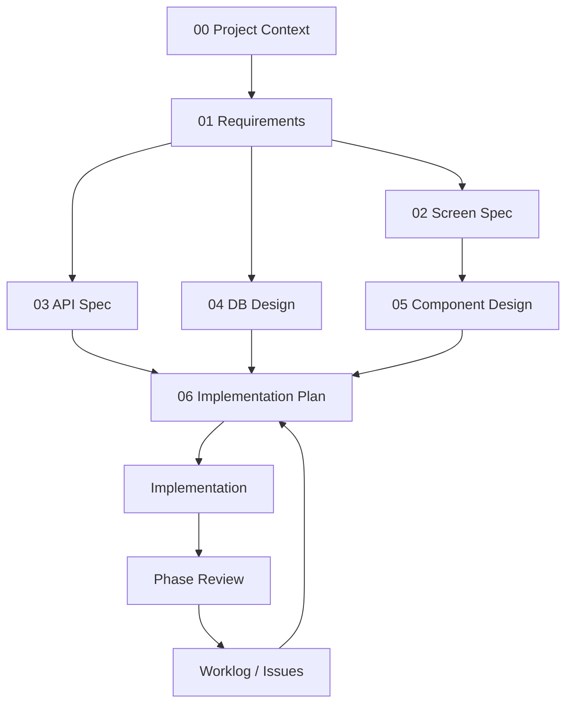
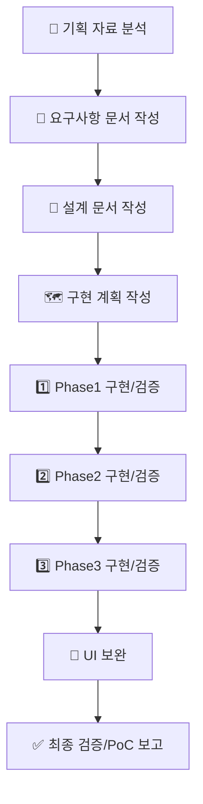
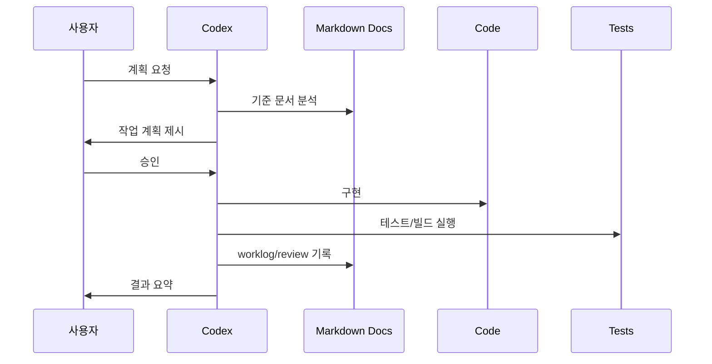
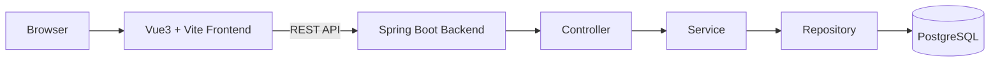
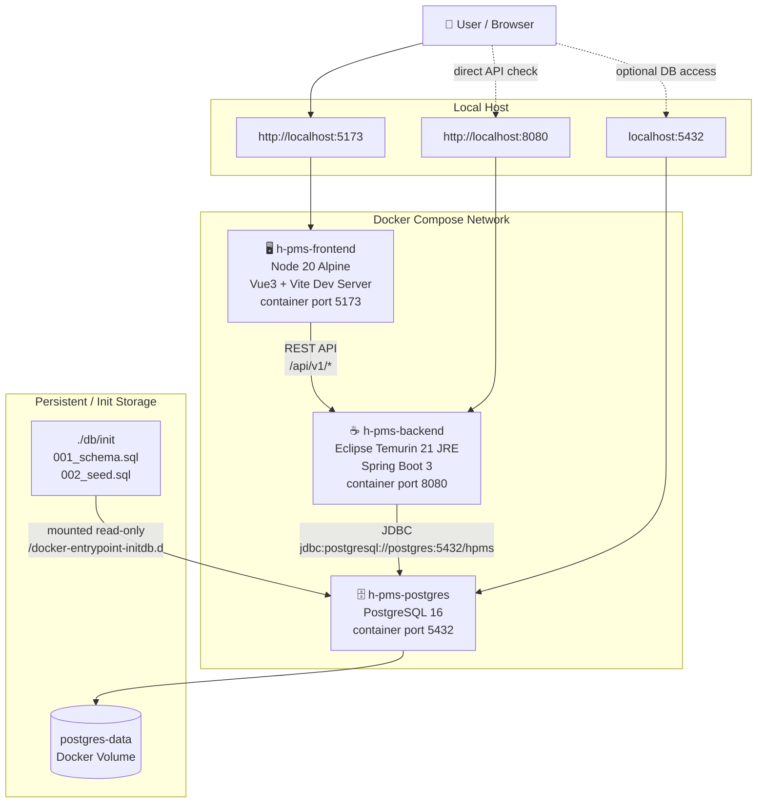
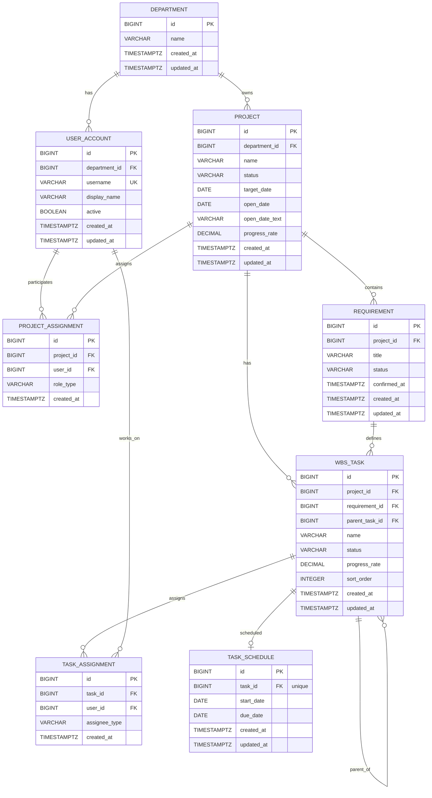

# 🚀 H-PMS Prototype: Codex 기반 Vibe Coding 개발 방법론

> **이 README는 일반적인 프로젝트 소개 문서가 아니다.**  
> H-PMS `내 업무` 프로토타입을 **무엇으로 만들었는지**보다, Codex를 활용해 **어떻게 기획하고, 설계하고, 구현하고, 검증했는지**를 설명한다.

이 프로젝트의 핵심은 코드 생성 결과가 아니라, Markdown 산출물을 다음 단계의 **Source of Truth**로 삼아 개발을 진행한 **Document Driven Development** 방식이다.

---

## 1. 🧭 Development Methodology

이번 프로젝트는 Codex와 함께 아래 흐름을 반복하며 진행했다.

```text
계획 -> 승인 -> 구현 -> 테스트 -> 문서화
```

> **핵심 원칙**  
> Codex는 바로 구현하지 않는다. 먼저 계획을 만들고, 사용자가 승인한 범위 안에서만 구현한다.

이 절차에서 Codex는 단순 코드 생성기가 아니라 **요구사항 분석가**, **설계 보조자**, **구현자**, **테스트 실행자**, **문서화 담당자** 역할을 수행했다. 사람은 범위, 우선순위, 승인 여부, 화면 의도, 제외 대상을 결정했다.


| 단계 | Codex 역할 | 사용자 역할 | 주요 산출물 |
| --- | --- | --- | --- |
| 📝 계획 | 구현 범위와 작업 순서 제안 | 범위 검토 | `docs/06_implementation_plan.md` |
| ✅ 승인 | 승인 전 대기 | 구현 승인 또는 조정 | 승인 프롬프트 |
| 💻 구현 | 코드, 설정, 테스트 작성 | 방향 확인 | `backend/`, `frontend/`, `db/`, `scripts/` |
| 🧪 테스트 | 명령 실행, 실패 분석, 재검증 | 결과 확인 | 테스트/빌드 로그 |
| 📚 문서화 | 결과, 실패 원인, 이슈 기록 | 우선순위 판단 | `docs/worklog.md`, `docs/issues.md` |

---

## 2. 📚 Document Driven Development

이 프로젝트의 핵심 개념은 **Document Driven Development**다.

코드를 먼저 작성한 뒤 문서를 보조 자료로 만든 것이 아니라, **Markdown 문서를 먼저 만들고 그 문서를 다음 단계의 Source of Truth로 사용했다.** 각 단계의 Markdown 산출물은 다음 단계 작업의 기준이 되었고, 구현 중 발견된 차이는 다시 문서에 기록했다.



**Document Driven Development 원칙**

- **Markdown 산출물이 다음 작업의 기준이다.**
- **Codex는 문서에 없는 기술 스택이나 기능을 임의로 추가하지 않는다.**
- **구현 전에는 계획을 먼저 작성하고 사용자 승인을 받는다.**
- **Phase 완료 후에는 코드 수정 없이 검증 리포트를 작성한다.**
- **실패, 예외, 보류 사항은 `docs/worklog.md`와 `docs/issues.md`에 남긴다.**

---

## 3. ✨ Why Vibe Coding

Vibe Coding은 AI에게 무작정 코드를 맡기는 방식이 아니다. 이번 프로젝트에서는 Codex가 빠르게 산출물을 만들 수 있는 장점을 활용하되, **문서와 승인 게이트로 범위를 통제했다.**

적용 이유는 다음과 같다.

- 📄 PPTX 화면 기획을 빠르게 요구사항 문서로 전환할 수 있다.
- 🧩 요구사항을 화면, API, DB, 컴포넌트 설계로 분해할 수 있다.
- 🏗️ Phase 단위로 작게 구현하고 바로 검증할 수 있다.
- 🧪 테스트 실패와 환경 문제를 worklog에 누적해 재현성을 높일 수 있다.
- 🤝 사람은 제품 판단과 범위 결정을 담당하고, Codex는 반복 작업과 정리를 담당할 수 있다.

---

## 4. 🧾 Project Overview

이 프로젝트는 H-PMS의 `내 업무` 기능을 대상으로 한 프로토타입이다.

다만 기능 구현의 목적은 최종 제품 완성이 아니라, **Codex 기반 개발 프로세스가 기획부터 로컬 통합 실행까지 적용 가능한지 검증하는 것**이다.

**검증 대상**

- PPTX 화면 기획 자료를 요구사항으로 전환
- 요구사항을 설계 문서로 분해
- 설계를 기준으로 Frontend, Backend, Database 구현
- Phase별 테스트와 리뷰 수행
- Docker Compose 기반 로컬 통합 실행 확인

### 카드형

### 캘린더형


---

## 5. 🎯 Project Goals

이 프로젝트의 목표는 **기능 목표**와 **방법론 목표**로 나뉜다.

| 구분 | 목표 |
| --- | --- |
| 🎯 기능 목표 | H-PMS `내 업무` 카드형/캘린더형 주요 조회 흐름 구현 |
| 📚 문서화 목표 | 개발 단계별 Markdown 산출물 생성 |
| 🔁 방법론 목표 | Codex와 계획, 승인, 구현, 테스트, 문서화 루프 검증 |
| 🐳 실행 목표 | PostgreSQL, Backend, Frontend를 Docker Compose로 로컬 실행 |
| 🧪 검증 목표 | Phase별 테스트, 빌드, API, 화면 검증 결과 기록 |

---

## 6. 🔁 Development Lifecycle

전체 개발 생명주기는 아래 순서로 진행했다.



### 6.1 📌 Planning

PPTX의 `내 업무` 화면을 분석해 요구사항을 정리했다. 이 단계에서는 구현하지 않고 **분석 산출물만 생성**했다.

**Source of Truth**

- `docs/01_requirements.md`

### 6.2 🧩 Design

요구사항 문서를 기준으로 화면, API, DB, 컴포넌트 설계를 분리했다. 설계 후에는 즉시 구현하지 않고 누락, 오류, 테스트 난이도, 확장 포인트를 검토했다.

**Source of Truth**

- `docs/02_screen_spec.md`
- `docs/03_api_spec.md`
- `docs/04_db_design.md`
- `docs/05_component_design.md`

### 6.3 🗺️ Implementation Planning

구현은 Phase 단위로 나누었다. 각 Phase는 수정 파일, 생성 파일, 예상 작업 시간, 테스트 방법, 위험 요소를 포함했다.

**Source of Truth**

- `docs/06_implementation_plan.md`

### 6.4 🏗️ Phase Development

| Phase | 목적 | 주요 작업 | 검증 문서 |
| --- | --- | --- | --- |
| 1️⃣ Phase1 | 실행 골격과 최소 기능 구성 | Backend/Frontend/Docker/DB/API 기본 연동 | `docs/07_phase1_review.md` |
| 2️⃣ Phase2 | 명세와 구조 정합화 | API query/paging 보완, JPA 전환, UX 일부 개선 | `docs/08_phase2_review.md` |
| 3️⃣ Phase3 | 화면 흐름과 테스트 보강 | Vitest 도입, placeholder 화면, 접근성 동작 보완 | `docs/09_final_function_review.md` |
| 🎨 Phase3 이후 | UI 사용성 보완 | 캘린더 막대, 상세 팝업, 반응형, breadcrumb 정리 | `docs/worklog.md` |

### 6.5 🐳 Local Deployment

운영 배포가 아니라 **Docker Compose 기반 로컬 통합 실행**을 배포 검증 범위로 정의했다.

**검증 기준**

- PostgreSQL 컨테이너 `healthy`
- Backend `8080` publish
- Frontend `5173` publish
- Backend health `UP`
- API 정상 응답
- 브라우저 화면 정상 표시

---

## 7. 🤖 Codex Workflow

Codex 작업은 항상 **문서와 승인 단위**로 제한했다.



### 실제 사용한 Prompt 예시

**요구사항 분석**

```text
업로드한 PPTX의 '내 업무' 화면을 분석하여 docs/01_requirements.md를 작성해라.

구현하지 말고 분석만 수행한다.
```

**기술 기준 고정**

```text
앞으로 모든 설계와 구현은 docs/00_project_context.md를 기준으로 수행한다.

기술 스택을 임의로 변경하거나 추가하지 않는다.
```

**설계 문서 생성**

```text
docs/01_requirements.md를 기준으로 구현을 위한 설계를 수행한다.

다음 문서를 생성해라.

docs/02_screen_spec.md
docs/03_api_spec.md
docs/04_db_design.md
docs/05_component_design.md

구현은 하지 않는다.
```

**Phase 구현 승인**

```text
Phase1 계획을 승인한다.

계획대로 구현하라.

구현 완료 후 backend 테스트, frontend 빌드, docker compose 실행,
API 확인, docs/worklog.md 기록을 수행하라.
```

**검증 리포트 작성**

```text
Phase 완료 상태를 기준으로 검증 리포트를 작성하라.

규칙:
- 코드는 수정하지 마라.
- 검증과 문서화만 수행하라.
```

---

## 8. 🧰 Skill Pack

이번 프로젝트에서 Codex에게 위임한 역할을 Skill Pack으로 정리하면 다음과 같다.

| Skill | 역할 | 대표 산출물 |
| --- | --- | --- |
| 📄 Requirements Analyst | PPTX 화면을 요구사항으로 정리 | `docs/01_requirements.md` |
| 🧩 System Designer | 화면/API/DB/컴포넌트 설계 | `docs/02_screen_spec.md` ~ `docs/05_component_design.md` |
| 🗺️ Implementation Planner | Phase별 구현 계획 작성 | `docs/06_implementation_plan.md` |
| ☕ Backend Engineer | Spring Boot API, JPA, 테스트 구현 | `backend/` |
| 🖥️ Frontend Engineer | Vue 화면, API 연동, 테스트 구현 | `frontend/` |
| 🐳 DevOps Assistant | Docker Compose와 실행 스크립트 구성 | `docker-compose.yml`, `scripts/` |
| 🧪 QA Reviewer | Phase별 검증 리포트 작성 | `docs/07_phase1_review.md`, `docs/08_phase2_review.md`, `docs/09_final_function_review.md` |
| ✍️ Technical Writer | 작업 이력과 이슈 문서화 | `docs/worklog.md`, `docs/issues.md`, `docs/11_vibecoding_methodology.md` |

---

## 9. 🗂️ Markdown Artifacts

개발 과정에서 생성된 Markdown 산출물은 단순 기록이 아니라 **다음 단계의 Source of Truth**로 사용했다.

| 단계 | 산출물 | 목적 |
| --- | --- | --- |
| 🧭 Context | `docs/00_project_context.md` | 기술 스택과 개발 원칙 고정 |
| 📄 Requirements | `docs/01_requirements.md` | PPTX 기반 요구사항 분석 |
| 🧩 Design | `docs/02_screen_spec.md` | 화면 구조와 UX 정의 |
| 🧩 Design | `docs/03_api_spec.md` | REST API 명세 |
| 🧩 Design | `docs/04_db_design.md` | DB 모델과 ERD 기준 |
| 🧩 Design | `docs/05_component_design.md` | Frontend 컴포넌트 구조 |
| 🗺️ Planning | `docs/06_implementation_plan.md` | Phase별 구현 계획 |
| 🔍 Review | `docs/07_phase1_review.md` | Phase1 검증 |
| 🔍 Review | `docs/08_phase2_review.md` | Phase2 검증 |
| 🔍 Review | `docs/09_final_function_review.md` | 최종 기능 검증 |
| 🤖 Methodology | `docs/11_vibecoding_methodology.md` | Vibe Coding 방법론 정리 |
| 📊 Report | `docs/12_poc_report.md` | PoC 결과 보고 |
| 🛠️ Operation | `docs/worklog.md` | 작업 이력 |
| 🛠️ Operation | `docs/issues.md` | 이슈 관리 |
| 📌 Assumption | `assumptions.md` | 적용 전제 기록 |

---

## 10. 🧱 Tech Stack

기술 스택은 사용자가 명시한 기준을 따랐고, **Codex가 임의로 변경하거나 추가하지 않도록 제한했다.**

| 영역 | 기술 |
| --- | --- |
| Frontend | Vue3, Vite, TypeScript, Vue Router, Pinia |
| Frontend Test | Vitest |
| Backend | Spring Boot 3.x, Java 21, Gradle |
| Persistence | Spring Data JPA |
| Database | PostgreSQL 16 |
| API | REST API |
| Architecture | Layered Architecture |
| Local Runtime | Docker, Docker Compose |

> **제약 사항**  
> Nuxt는 사용하지 않는다. 기술 스택은 `docs/00_project_context.md` 기준을 따른다.

---

## 11. 🏛️ Architecture



**구현 원칙**

- Frontend는 REST API를 통해 Backend와 통신한다.
- Backend는 Controller, Service, Repository 계층을 따른다.
- DTO를 사용하고 Entity를 직접 노출하지 않는다.
- PostgreSQL은 Docker Compose로 로컬 실행한다.

---

## 12. 🗄️ DB Schema

ERD는 이 섹션에 배치한다. 이미지로 관리할 경우 아래 Placeholder를 사용한다.



DB 설계는 카드형/캘린더형 화면에 필요한 **프로젝트, 요구사항, WBS 업무, 일정, 담당자 관계**를 표현한다.

**DB 초기화 파일**

- `db/init/001_schema.sql`
- `db/init/002_seed.sql`

---

## 13. 📁 Project Structure

```text
backend/              Spring Boot Backend
frontend/             Vue3 Frontend
db/init/              PostgreSQL schema/seed SQL
docs/                 개발 과정 Markdown 산출물
scripts/              실행/테스트/빌드 스크립트
docker-compose.yml    로컬 통합 실행 구성
assumptions.md        적용 전제 기록
```

> **중요**  
> `docs/`는 보조 문서 폴더가 아니라 개발 기준을 제공하는 핵심 디렉터리다.

---

## 14. ▶️ How to Run

전체 로컬 개발 환경은 Docker Compose로 실행한다.

```bash
./scripts/dev-start.sh
```

수동 실행:

```bash
docker compose up -d --build
```

**기본 접속 정보**

| Service | URL |
| --- | --- |
| Frontend | `http://localhost:5173` |
| Backend | `http://localhost:8080` |
| Backend Health | `http://localhost:8080/actuator/health` |
| Swagger UI | `http://localhost:8080/swagger-ui/index.html` |
| PostgreSQL | `localhost:5432` |

**PostgreSQL 기본 정보**

| 항목 | 값 |
| --- | --- |
| Database | `hpms` |
| User | `hpms` |
| Password | `hpms` |

**Frontend 개별 실행**

```bash
cd frontend
npm install
npm run dev
```

**Backend 개별 실행**

```bash
cd backend
./gradlew bootRun
```

### 카드형

### 캘린더형


---

## 15. 🧪 Test and Build Strategy

테스트와 빌드는 구현 후 확인 작업이 아니라 **개발 루프의 일부**로 수행했다.

| 영역 | 명령 | 목적 |
| --- | --- | --- |
| Backend test | `cd backend && ./gradlew test` | Service/API 테스트 확인 |
| Backend build | `cd backend && ./gradlew build` | Backend 빌드 가능 여부 확인 |
| Frontend type-check | `cd frontend && npm run type-check` | TypeScript 정합성 확인 |
| Frontend test | `cd frontend && npm run test` | Frontend 유틸 테스트 확인 |
| Frontend build | `cd frontend && npm run build` | Frontend 빌드 가능 여부 확인 |
| Docker Compose | `docker compose up -d --build` | 로컬 통합 실행 확인 |
| API check | `curl` | REST API 응답 확인 |
| Browser check | 브라우저 | 화면과 상호작용 확인 |

검증 중 실패한 항목은 **원인을 분석하고 수정한 뒤 재실행**했다. 결과는 `docs/worklog.md`, `docs/issues.md`, Phase별 review 문서에 기록했다.

---

## 16. 💡 Lessons Learned

이번 PoC를 통해 확인한 점은 다음과 같다.

- **Codex 결과물의 품질은 입력 문서의 명확성에 크게 의존한다.**
- **Markdown 산출물을 Source of Truth로 삼으면 AI 작업 범위를 통제하기 쉽다.**
- 승인 게이트가 없으면 구현 범위가 빠르게 넓어질 수 있다.
- Phase 리뷰는 설계와 구현 사이의 차이를 발견하는 데 효과적이다.
- 테스트/빌드 명령은 Prompt에 명시해야 누락되지 않는다.
- 화면 의도와 제품 판단은 사람이 명확히 내려야 한다.
- 로컬 환경 문제는 실제 명령 실행과 로그 확인이 필요하다.

---

## 17. 🔮 Future Improvements

본 개발 또는 후속 PoC에서는 다음 항목을 개선할 수 있다.

- CI/CD 구성
- OpenAPI 문서 자동화
- E2E 테스트 추가
- Frontend 컴포넌트 테스트 확대
- 인증/권한 본구현
- 일정 등록/수정/삭제 구현
- WBS 상세 본기능 구현
- npm audit 취약점 정비
- 운영 배포 전략 수립
- Architecture Diagram, ERD, Screenshot 이미지 산출물 정리

---

## 18. ✅ Conclusion

이 프로젝트의 결과물은 동작하는 H-PMS `내 업무` 프로토타입만이 아니다.

더 중요한 결과는 **Codex와 함께 기획, 설계, 구현, 테스트, 로컬 배포 검증을 반복 가능한 절차로 구성했다는 점**이다.

> **이번 Vibe Coding PoC의 핵심**  
> Markdown 산출물을 Source of Truth로 삼고, 계획과 승인을 거쳐 Phase 단위로 구현하며, 검증 결과를 다시 문서화하는 개발 흐름을 만들었다.
