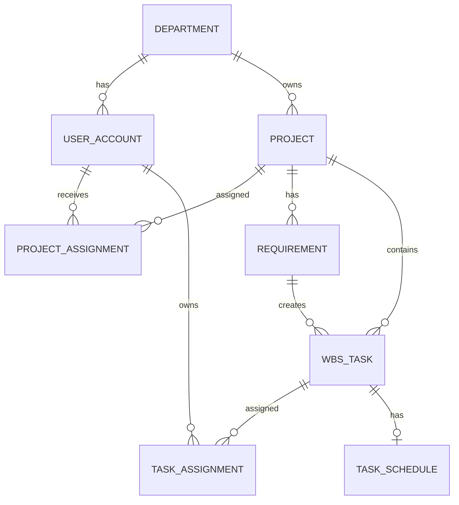

# 내 업무 DB 설계서

## 1. 문서 목적

본 문서는 내 업무 기능 구현을 위한 PostgreSQL 기반 데이터 구조를 정의한다. 설계 기준은 `docs/00_project_context.md`를 따른다.

- Database: PostgreSQL 16
- Backend: Spring Data JPA
- Architecture: Layered Architecture
- Entity 직접 노출 금지, DTO 사용

## 2. 설계 범위

내 업무 화면에 필요한 조회 중심 테이블을 정의한다.

- 사용자
- 부서
- 프로젝트
- 프로젝트 배정
- WBS 업무
- 업무 일정
- 업무 담당자
- 요구사항 확정 이력

프로토타입 단계에서는 실제 조직/인증 시스템을 단순화할 수 있으나, 운영 전환을 고려해 사용자와 배정 관계는 분리한다.

## 3. ERD 개요

## 4. 테이블 목록

| 테이블 | 설명 |
| --- | --- |
| `department` | 부서/조직 |
| `user_account` | 사용자 |
| `project` | 프로젝트 |
| `project_assignment` | 사용자별 프로젝트 배정 |
| `requirement` | 요구사항 |
| `wbs_task` | WBS 업무 |
| `task_assignment` | 사용자별 업무 배정 |
| `task_schedule` | 업무 일정 |

## 5. 테이블 상세

### 5.1 department

| 컬럼 | 타입 | 제약 | 설명 |
| --- | --- | --- | --- |
| id | bigint | PK | 부서 ID |
| name | varchar(100) | NOT NULL | 부서명 |
| created_at | timestamptz | NOT NULL | 생성일시 |
| updated_at | timestamptz | NOT NULL | 수정일시 |

### 5.2 user_account

| 컬럼 | 타입 | 제약 | 설명 |
| --- | --- | --- | --- |
| id | bigint | PK | 사용자 ID |
| department_id | bigint | FK | 소속 부서 ID |
| username | varchar(100) | NOT NULL, UNIQUE | 로그인 계정 |
| display_name | varchar(100) | NOT NULL | 표시명 |
| active | boolean | NOT NULL | 활성 여부 |
| created_at | timestamptz | NOT NULL | 생성일시 |
| updated_at | timestamptz | NOT NULL | 수정일시 |

### 5.3 project

| 컬럼 | 타입 | 제약 | 설명 |
| --- | --- | --- | --- |
| id | bigint | PK | 프로젝트 ID |
| department_id | bigint | FK | 담당 부서 ID |
| name | varchar(200) | NOT NULL | 프로젝트명 |
| status | varchar(30) | NOT NULL | 프로젝트 상태 |
| target_date | date | NULL | 기준일 또는 목표일 |
| open_date | date | NULL | 오픈 예정일 |
| open_date_text | varchar(50) | NULL | `오픈일 미정` 등 표시용 문구 |
| progress_rate | numeric(5,2) | NOT NULL | 공정률 |
| created_at | timestamptz | NOT NULL | 생성일시 |
| updated_at | timestamptz | NOT NULL | 수정일시 |

상태 후보:

| 값 | 표시명 |
| --- | --- |
| TESTING | 테스트 |
| DISCUSSING | 협의중 |
| PROCESSING | 처리중 |
| RECEIVED | 접수 |

프로토타입 집계 기준:

- 진행 프로젝트: `TESTING`, `DISCUSSING`, `PROCESSING`
- 대기 프로젝트: `RECEIVED`

### 5.4 project_assignment

| 컬럼 | 타입 | 제약 | 설명 |
| --- | --- | --- | --- |
| id | bigint | PK | 프로젝트 배정 ID |
| project_id | bigint | FK, NOT NULL | 프로젝트 ID |
| user_id | bigint | FK, NOT NULL | 사용자 ID |
| role_type | varchar(30) | NOT NULL | 프로젝트 내 역할 |
| created_at | timestamptz | NOT NULL | 생성일시 |

유니크 제약:

| 컬럼 | 설명 |
| --- | --- |
| project_id, user_id, role_type | 동일 프로젝트/사용자/역할 중복 방지 |

### 5.5 requirement

| 컬럼 | 타입 | 제약 | 설명 |
| --- | --- | --- | --- |
| id | bigint | PK | 요구사항 ID |
| project_id | bigint | FK, NOT NULL | 프로젝트 ID |
| title | varchar(200) | NOT NULL | 요구사항명 |
| status | varchar(30) | NOT NULL | 요구사항 상태 |
| confirmed_at | timestamptz | NULL | 확정일시 |
| created_at | timestamptz | NOT NULL | 생성일시 |
| updated_at | timestamptz | NOT NULL | 수정일시 |

정책:

- `status = CONFIRMED`가 되면 WBS 작업범위 생성 대상이 된다.

### 5.6 wbs_task

| 컬럼 | 타입 | 제약 | 설명 |
| --- | --- | --- | --- |
| id | bigint | PK | WBS 업무 ID |
| project_id | bigint | FK, NOT NULL | 프로젝트 ID |
| requirement_id | bigint | FK | 생성 원천 요구사항 ID |
| parent_task_id | bigint | FK | 상위 WBS 업무 ID |
| name | varchar(200) | NOT NULL | 업무명 |
| status | varchar(30) | NOT NULL | 업무 상태 |
| progress_rate | numeric(5,2) | NOT NULL | 업무 공정률 |
| sort_order | integer | NOT NULL | 표시 순서 |
| created_at | timestamptz | NOT NULL | 생성일시 |
| updated_at | timestamptz | NOT NULL | 수정일시 |

업무 상태 후보:

| 값 | 설명 |
| --- | --- |
| TODO | 대기 |
| IN_PROGRESS | 진행중 |
| DONE | 완료 |
| HOLD | 보류 |

프로토타입 집계 기준:

- 내 할 일: `TODO`, `IN_PROGRESS`, `HOLD`
- 완료 제외: `DONE`

### 5.7 task_assignment

| 컬럼 | 타입 | 제약 | 설명 |
| --- | --- | --- | --- |
| id | bigint | PK | 업무 배정 ID |
| task_id | bigint | FK, NOT NULL | WBS 업무 ID |
| user_id | bigint | FK, NOT NULL | 담당 사용자 ID |
| assignee_type | varchar(30) | NOT NULL | 담당 유형 |
| created_at | timestamptz | NOT NULL | 생성일시 |

유니크 제약:

| 컬럼 | 설명 |
| --- | --- |
| task_id, user_id, assignee_type | 동일 업무/사용자/담당 유형 중복 방지 |

### 5.8 task_schedule

| 컬럼 | 타입 | 제약 | 설명 |
| --- | --- | --- | --- |
| id | bigint | PK | 일정 ID |
| task_id | bigint | FK, NOT NULL, UNIQUE | WBS 업무 ID |
| start_date | date | NULL | 시작일 |
| due_date | date | NULL | 마감일 |
| created_at | timestamptz | NOT NULL | 생성일시 |
| updated_at | timestamptz | NOT NULL | 수정일시 |

정책:

- `task_schedule`이 존재하고 `due_date`가 있으면 캘린더 표시 대상이다.
- `task_schedule`이 없거나 `due_date`가 없으면 일정 미등록 업무로 분류한다.

## 6. 조회 설계

### 6.1 내 업무 기준

로그인 사용자가 담당자인 업무는 다음 조건으로 조회한다.

- `task_assignment.user_id = currentUserId`
- `user_account.active = true`

### 6.2 진행 프로젝트 기준

진행 프로젝트는 다음 조건으로 조회한다.

- `project_assignment.user_id = currentUserId`
- `project.status in (TESTING, DISCUSSING, PROCESSING)`

### 6.3 대기 프로젝트 기준

대기 프로젝트는 다음 조건으로 조회한다.

- `project_assignment.user_id = currentUserId`
- `project.status = RECEIVED`

### 6.4 캘린더 일정 기준

캘린더 일정은 다음 조건으로 조회한다.

- `task_assignment.user_id = currentUserId`
- `task_schedule.due_date is not null`
- `task_schedule.start_date`와 `task_schedule.due_date` 기간이 조회 월 범위와 겹치거나, `due_date`가 조회 월 범위에 포함

### 6.5 일정 미등록 업무 기준

일정 미등록 업무는 다음 조건으로 조회한다.

- `task_assignment.user_id = currentUserId`
- `task_schedule.id is null` 또는 `task_schedule.due_date is null`

## 7. 집계 설계

| 지표 | 집계 기준 |
| --- | --- |
| 진행 프로젝트 수 | 사용자 배정 프로젝트 중 진행 상태 프로젝트 수 |
| 내 할 일 수 | 사용자 배정 WBS 업무 중 `DONE`이 아닌 업무 수 |
| 금주 마감 수 | 사용자 배정 업무 중 `DONE`이 아니고 마감일이 서버 기준일이 속한 월요일~일요일에 포함되는 업무 수 |
| 지연 수 | 사용자 배정 업무 중 `DONE`이 아니고 마감일이 서버 기준일보다 이전인 업무 수 |
| 대기 수 | 사용자 배정 프로젝트 중 접수 상태 프로젝트 수 |

기준:

- 서버 기준일은 Backend 애플리케이션의 `Asia/Seoul` 날짜를 사용한다.
- 일정 미등록 업무는 마감일이 없으므로 `금주 마감`과 `지연` 집계에서 제외한다.
- 화면의 `지연`, `오늘 마감`, `일정 미등록`은 DB 저장 상태가 아니라 조회 시 계산되는 파생 상태다.

## 8. 인덱스 설계

| 테이블 | 인덱스 컬럼 | 목적 |
| --- | --- | --- |
| `project_assignment` | `user_id`, `project_id` | 사용자별 프로젝트 조회 |
| `task_assignment` | `user_id`, `task_id` | 사용자별 업무 조회 |
| `task_schedule` | `due_date` | 월간 캘린더 조회 |
| `task_schedule` | `start_date`, `due_date` | 기간 겹침 캘린더 조회 |
| `task_schedule` | `task_id` | 업무별 일정 조회 |
| `project` | `status` | 진행/대기 프로젝트 필터 |
| `wbs_task` | `project_id`, `status` | 프로젝트별 업무 조회 |

## 9. JPA 매핑 유의사항

- Entity는 API 응답으로 직접 반환하지 않는다.
- Controller 응답은 DTO를 사용한다.
- `Project`와 `WbsTask`는 다대일 관계를 기본으로 매핑한다.
- 목록 조회 성능을 위해 내 업무 화면 조회는 필요한 경우 전용 Query DTO를 사용한다.
- 캘린더 조회는 월 범위 조건을 명확히 적용한다.

## 10. 구현 제외

본 문서는 DB 설계 문서이며 구현은 포함하지 않는다.

- SQL DDL 파일 생성 없음
- Flyway/Liquibase 마이그레이션 생성 없음
- JPA Entity 클래스 생성 없음
- Repository 코드 생성 없음
